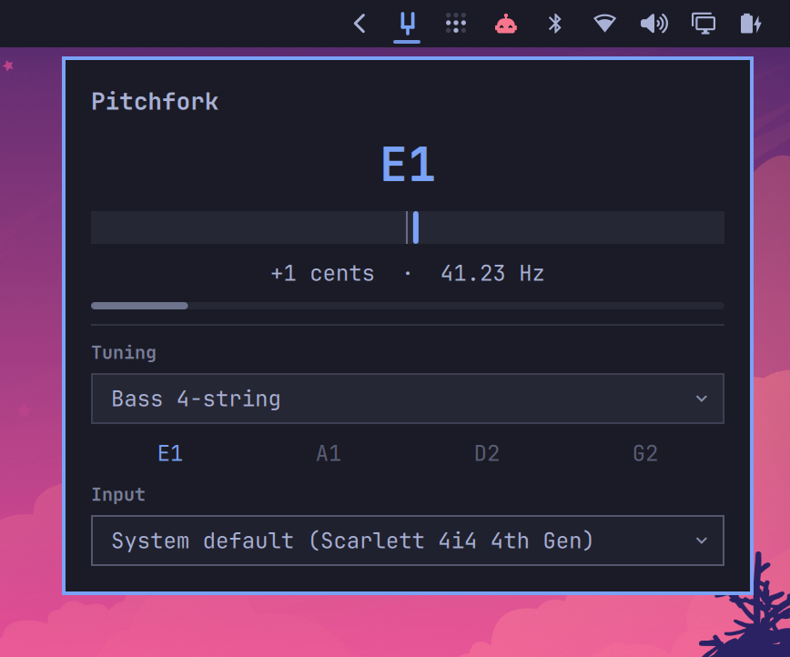

# Pitchfork

An instrument tuner for the Omarchy Quattro bar. Note, cents, and input level
for a guitar or bass, read from a PipeWire input.



## Install

```
omarchy plugin add https://github.com/KeMezz/omarchy-pitchfork.git --enable
```

Needs `pw-cat` (ships with PipeWire) and `python3` 3.12 or newer, both present
on a stock Omarchy system.

## Use

Click the tuning fork in the bar. Pick an input, pick a tuning, play a note.

- **Chromatic** names the nearest of the twelve semitones.
- Any other tuning names the nearest of *its own strings*, so a string a whole
  tone flat still reads as the string you meant rather than as its neighbour.
  Those strings sit under the meter and light up as each is played in tune.
- The fork in the bar turns the accent colour while the note is in tune, so it
  reads at a glance with the panel closed.

A laptop's internal microphone is a poor input for this. Its noise floor is high
enough that a quietly played instrument never becomes the most periodic thing in
the window, and an unplugged electric instrument is not audible to it at all.

## What it does to your machine

Plugins run unsandboxed inside the long-lived shell process, so:

- It opens an audio input **only while the panel is open**. Audio is analysed a
  window at a time in memory and discarded — nothing is written to disk and
  nothing leaves the machine.
- It spawns one child process, `pw-cat`, bound to the panel's lifetime even if
  the shell kills the plugin outright.
- No network. No `sudo`, no `pkexec`, no systemd units, no installer, no
  bundled binaries.

## Development

```
make check   # validate the manifest, lint QML, run the pitch tests
make sync    # copy a validated change into the local Omarchy install
make summon  # open the panel
```

A QML change also needs `omarchy-restart-shell`: this Omarchy build has no hot
reload for local plugin components, so a synced `.qml` sits on disk while the
shell serves the copy it loaded at startup. The detector script does not need
the restart.

If no note appears, `scripts/pitch-detect.py --meter` shows what the detector
actually hears — a moving level bar means capture works, and the aperiodicity
figure says how close a rejected reading was to registering.

[Design notes](docs/design.md) cover the detection algorithm, the detector's
line protocol, the tuning model, and why there are no external dependencies.

## License

MIT. See `LICENSE`.
