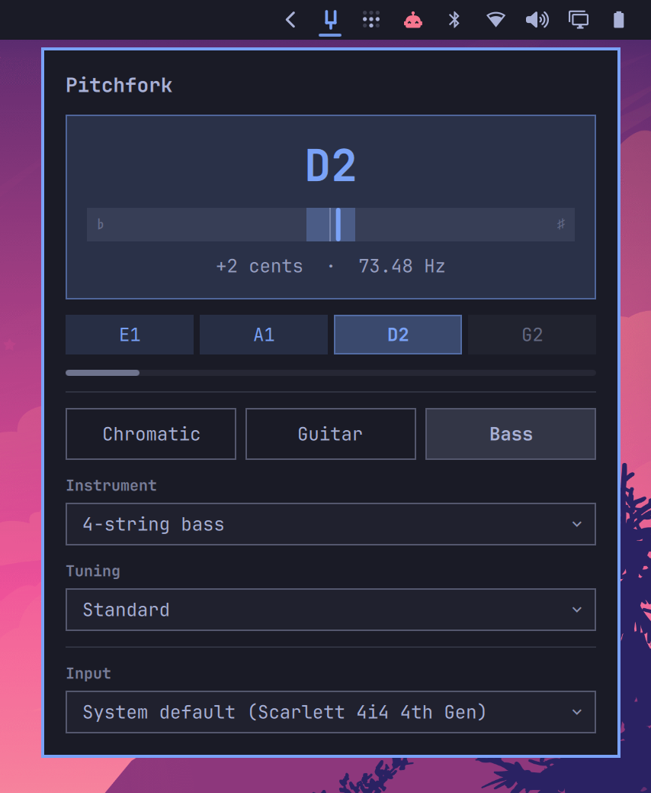

# Pitchfork

An instrument tuner for the Omarchy Quattro bar. Note, cents, and input level
for a guitar or bass, read from a PipeWire input.



## Install

```
omarchy plugin add https://github.com/KeMezz/omarchy-pitchfork.git --enable
```

Needs `pw-cat` (ships with PipeWire) and `python3` 3.12 or newer, both present
on a stock Omarchy system. Nothing else is installed and nothing is compiled.

## Update and remove

```
omarchy plugin update io.github.kemezz.pitchfork
omarchy plugin remove io.github.kemezz.pitchfork
```

Removing deletes the plugin directory and takes the widget out of the bar. Your
chosen input and instrument live in `~/.config/omarchy-pitchfork/`, outside the
plugin directory, so delete that too for a clean uninstall:

```
rm -rf ~/.config/omarchy-pitchfork
```

## Use

Click the tuning fork in the bar, pick **Chromatic**, **Guitar** or **Bass**,
and play a note.

- **Chromatic** names the nearest of the twelve semitones, and asks nothing else.
- **Guitar** and **Bass** add two rows: the instrument (6- or 7-string guitar,
  4-, 5- or 6-string bass) and the tuning applied to it (standard, drop,
  half- or full-step down, DADGAD). The readout then names the nearest of *that
  instrument's own strings*, so a string a whole tone flat still reads as the
  string you meant rather than as its neighbour. The strings sit under the meter
  and fill in as each is played in tune.
- In tune, the whole readout turns the accent colour — and so does the fork in
  the bar, so it reads at a glance with the panel closed.

A laptop's internal microphone is a poor input for this. Its noise floor is high
enough that a quietly played instrument never becomes the most periodic thing in
the window, and an unplugged electric instrument is not audible to it at all.

## What it does to your machine

Plugins run unsandboxed inside the long-lived shell process, so:

- It opens an audio input **only while the panel is open**. Audio is analysed a
  window at a time in memory and discarded — nothing is written to disk and
  nothing leaves the machine.
- While the panel is open it runs `python3 scripts/pitch-detect.py`, which in
  turn runs `pw-cat` to read the input. Both are bound to the panel's lifetime
  even if the shell kills the plugin outright. One `mkdir -p` creates
  `~/.config/omarchy-pitchfork/` for the settings file.
- No network. No sudo, no pkexec, no systemd units, no installer, no bundled
  binaries, nothing downloaded or compiled at any point.
- It writes exactly one file, `~/.config/omarchy-pitchfork/settings.json`, and
  never touches your Omarchy configuration.

## Development

```
make check   # validate the manifest, lint QML, run the pitch tests
make sync    # copy a validated change into the local Omarchy install
make summon  # open the panel
```

A QML change also needs `omarchy-restart-shell`: this Omarchy build has no hot
reload for local plugin components, so a synced `.qml` sits on disk while the
shell serves the copy it loaded at startup. The detector script does not need
the restart.

If no note appears, `scripts/pitch-detect.py --meter` shows what the detector
actually hears — a moving level bar means capture works, and the aperiodicity
figure says how close a rejected reading was to registering.

[Design notes](docs/design.md) cover the detection algorithm, the detector's
line protocol, the tuning model, and why there are no external dependencies.

## License

MIT. See `LICENSE`.
